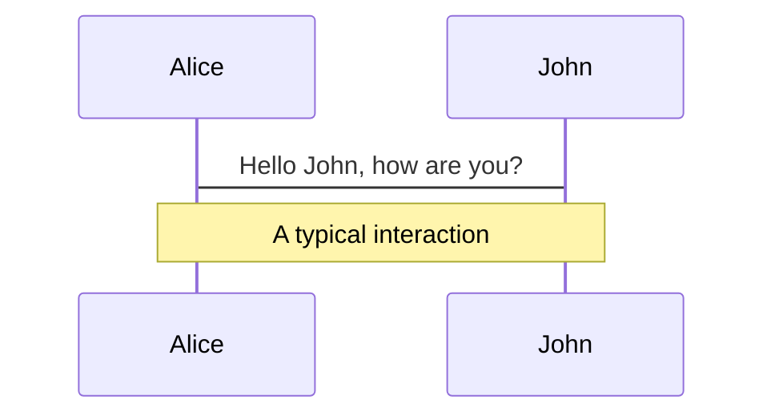
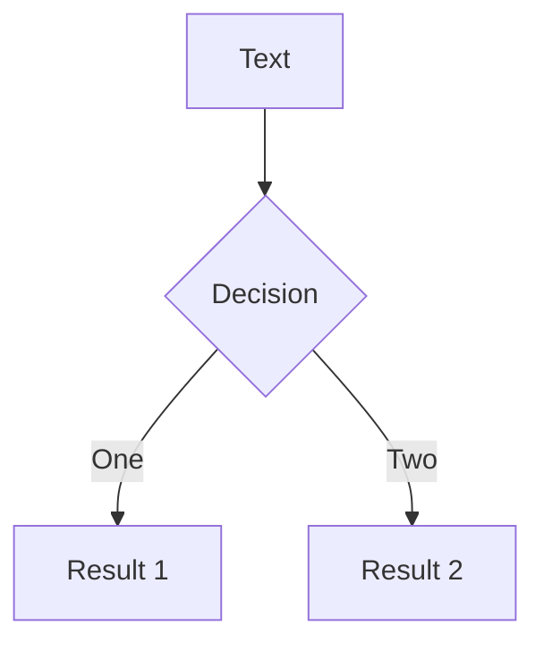
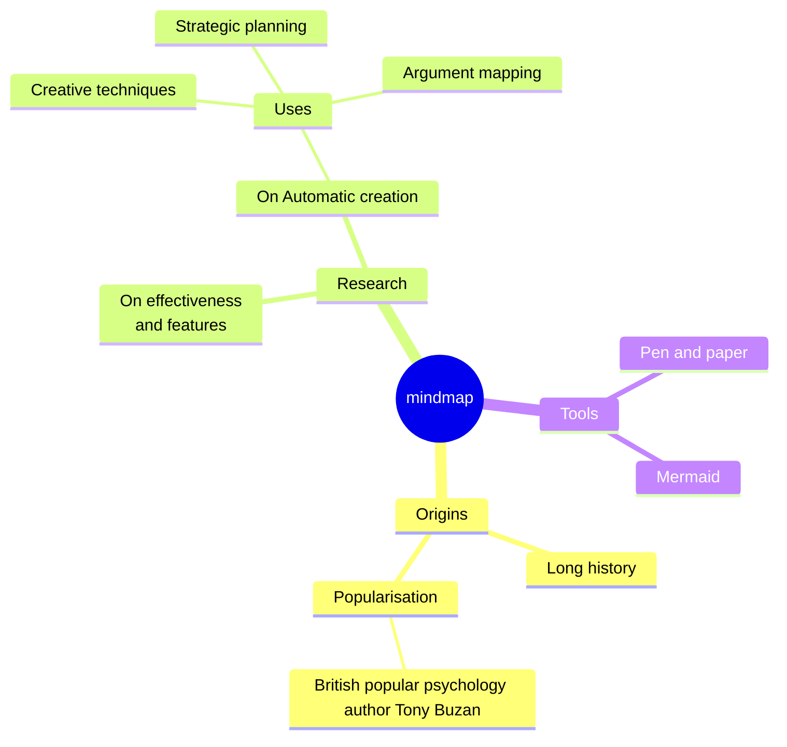
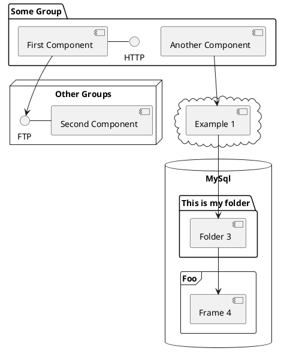

---
# You can also start simply with 'default'
theme: seriph
# random image from a curated Unsplash collection by Anthony
# like them? see https://unsplash.com/collections/94734566/slidev
background: https://cover.sli.dev
# some information about your slides (markdown enabled)
title: Welcome to Slidev
info: |
  ## Slidev Starter Template
  Presentation slides for developers.

  Learn more at [Sli.dev](https://sli.dev)
# apply unocss classes to the current slide
class: text-center
# https://sli.dev/features/drawing
drawings:
  persist: false
# slide transition: https://sli.dev/guide/animations.html#slide-transitions
transition: slide-left
# enable MDC Syntax: https://sli.dev/features/mdc
mdc: true
# open graph
# seoMeta:
#  ogImage: https://cover.sli.dev
---

# Welcome to Slidev

Presentation slides for developers

<div @click="$slidev.nav.next" class="mt-12 py-1" hover:bg="white op-10">
  Press Space for next page <carbon:arrow-right />
</div>

<div class="abs-br m-6 text-xl">
  <button @click="$slidev.nav.openInEditor()" title="Open in Editor" class="slidev-icon-btn">
    <carbon:edit />
  </button>
  <a href="https://github.com/slidevjs/slidev" target="_blank" class="slidev-icon-btn">
    <carbon:logo-github />
  </a>
</div>


---
transition: slide-down
src: ../00-course-setup/README.md
---

<!--
The last comment block of each slide will be treated as slide notes. It will be visible and editable in Presenter Mode along with the slide. [Read more in the docs](https://sli.dev/guide/syntax.html#notes)
-->

---
transition: fade-out
src: ../01-intro-to-ai-agents/README.md
---

---
src: ../02-explore-agentic-frameworks/README.md
---

---
src: ../03-agentic-design-patterns/README.md
---

---
src: ../04-tool-use/README.md
---

---
src: ../05-agentic-rag/README.md
---

---
src: ../06-building-trustworthy-agents/README.md
---

---
src: ../07-planning-design/README.md
---

---
src: ../08-multi-agent/README.md
---

---
src: ../09-metacognition/README.md
---

---
src: ../10-ai-agents-production/README.md
---

---
src: ../11-mcp/README.md
---

# What is Slidev?

Slidev is a slides maker and presenter designed for developers, consist of the following features

- 📝 **Text-based** - focus on the content with Markdown, and then style them later
- 🎨 **Themable** - themes can be shared and re-used as npm packages
- 🧑‍💻 **Developer Friendly** - code highlighting, live coding with autocompletion
- 🤹 **Interactive** - embed Vue components to enhance your expressions
- 🎥 **Recording** - built-in recording and camera view
- 📤 **Portable** - export to PDF, PPTX, PNGs, or even a hostable SPA
- 🛠 **Hackable** - virtually anything that's possible on a webpage is possible in Slidev
<br>
<br>

Read more about [Why Slidev?](https://sli.dev/guide/why)

<!--
You can have `style` tag in markdown to override the style for the current page.
Learn more: https://sli.dev/features/slide-scope-style
-->

<style>
h1 {
  background-color: #2B90B6;
  background-image: linear-gradient(45deg, #4EC5D4 10%, #146b8c 20%);
  background-size: 100%;
  -webkit-background-clip: text;
  -moz-background-clip: text;
  -webkit-text-fill-color: transparent;
  -moz-text-fill-color: transparent;
}
</style>

<!--
Here is another comment.
-->

---
transition: slide-up
level: 2
---

# Navigation

Hover on the bottom-left corner to see the navigation's controls panel, [learn more](https://sli.dev/guide/ui#navigation-bar)

## Keyboard Shortcuts

|                                                     |                             |
| --------------------------------------------------- | --------------------------- |
| <kbd>right</kbd> / <kbd>space</kbd>                 | next animation or slide     |
| <kbd>left</kbd>  / <kbd>shift</kbd><kbd>space</kbd> | previous animation or slide |
| <kbd>up</kbd>                                       | previous slide              |
| <kbd>down</kbd>                                     | next slide                  |

<!-- https://sli.dev/guide/animations.html#click-animation -->

<p v-after class="absolute bottom-23 left-45 opacity-30 transform -rotate-10">Here!</p>

---
layout: two-cols
layoutClass: gap-16
---

# Table of contents

You can use the `Toc` component to generate a table of contents for your slides:

```html
<Toc minDepth="1" maxDepth="1" />
```

The title will be inferred from your slide content, or you can override it with `title` and `level` in your frontmatter.

::right::

<Toc text-sm minDepth="1" maxDepth="2" />

---
layout: image-right
image: https://cover.sli.dev
---

# Code

Use code snippets and get the highlighting directly, and even types hover!

```ts {all|5|7|7-8|10|all} twoslash
// TwoSlash enables TypeScript hover information
// and errors in markdown code blocks
// More at https://shiki.style/packages/twoslash

import { computed, ref } from 'vue'

const count = ref(0)
const doubled = computed(() => count.value * 2)

doubled.value = 2
```

<arrow v-click="[4, 5]" x1="350" y1="310" x2="195" y2="334" color="#953" width="2" arrowSize="1" />

<!-- This allow you to embed external code blocks -->
<<< @/snippets/external.ts#snippet

<!-- Footer -->

[Learn more](https://sli.dev/features/line-highlighting)

<!-- Inline style -->
<style>
.footnotes-sep {
  @apply mt-5 opacity-10;
}
.footnotes {
  @apply text-sm opacity-75;
}
.footnote-backref {
  display: none;
}
</style>

<!--
Notes can also sync with clicks

[click] This will be highlighted after the first click

[click] Highlighted with `count = ref(0)`

[click:3] Last click (skip two clicks)
-->

---
level: 2
---

# Shiki Magic Move

Powered by [shiki-magic-move](https://shiki-magic-move.netlify.app/), Slidev supports animations across multiple code snippets.

Add multiple code blocks and wrap them with <code>````md magic-move</code> (four backticks) to enable the magic move. For example:

````md magic-move {lines: true}
```ts {*|2|*}
// step 1
const author = reactive({
  name: 'John Doe',
  books: [
    'Vue 2 - Advanced Guide',
    'Vue 3 - Basic Guide',
    'Vue 4 - The Mystery'
  ]
})
```

```ts {*|1-2|3-4|3-4,8}
// step 2
export default {
  data() {
    return {
      author: {
        name: 'John Doe',
        books: [
          'Vue 2 - Advanced Guide',
          'Vue 3 - Basic Guide',
          'Vue 4 - The Mystery'
        ]
      }
    }
  }
}
```

```ts
// step 3
export default {
  data: () => ({
    author: {
      name: 'John Doe',
      books: [
        'Vue 2 - Advanced Guide',
        'Vue 3 - Basic Guide',
        'Vue 4 - The Mystery'
      ]
    }
  })
}
```

Non-code blocks are ignored.

```vue
<!-- step 4 -->
<script setup>
const author = {
  name: 'John Doe',
  books: [
    'Vue 2 - Advanced Guide',
    'Vue 3 - Basic Guide',
    'Vue 4 - The Mystery'
  ]
}
</script>
```
````

---

# Components

<div grid="~ cols-2 gap-4">
<div>

You can use Vue components directly inside your slides.

We have provided a few built-in components like `<Tweet/>` and `<Youtube/>` that you can use directly. And adding your custom components is also super easy.

```html
<Counter :count="10" />
```

<!-- ./components/Counter.vue -->
<Counter :count="10" m="t-4" />

Check out [the guides](https://sli.dev/builtin/components.html) for more.

</div>
<div>

```html
<Tweet id="1390115482657726468" />
```

<Tweet id="1390115482657726468" scale="0.65" />

</div>
</div>

<!--
Presenter note with **bold**, *italic*, and ~~striked~~ text.

Also, HTML elements are valid:
<div class="flex w-full">
  <span style="flex-grow: 1;">Left content</span>
  <span>Right content</span>
</div>
-->

---
class: px-20
---

# Themes

Slidev comes with powerful theming support. Themes can provide styles, layouts, components, or even configurations for tools. Switching between themes by just **one edit** in your frontmatter:

<div grid="~ cols-2 gap-2" m="t-2">

```yaml
---
theme: default
---
```

```yaml
---
theme: seriph
---
```


</div>

Read more about [How to use a theme](https://sli.dev/guide/theme-addon#use-theme) and
check out the [Awesome Themes Gallery](https://sli.dev/resources/theme-gallery).

---

# Clicks Animations

You can add `v-click` to elements to add a click animation.

<div v-click>

This shows up when you click the slide:

```html
<div v-click>This shows up when you click the slide.</div>
```

</div>

<br>

<v-click>

The <span v-mark.red="3"><code>v-mark</code> directive</span>
also allows you to add
<span v-mark.circle.orange="4">inline marks</span>
, powered by [Rough Notation](https://roughnotation.com/):

```html
<span v-mark.underline.orange>inline markers</span>
```

</v-click>

<div mt-20 v-click>

[Learn more](https://sli.dev/guide/animations#click-animation)

</div>

---

## Running the Code

This course offers a series of Jupyter Notebooks that you can run with to get hands-on experience building AI Agents.

The code samples use either:

**Requires GitHub Accont - Free**:

1) Semantic Kernel Agent Framework + GitHub Models Marketplace. Labeled as (semantic-kernel.ipynb)
2) AutoGen Framework + GitHub Models Marketplace. Labeled as (autogen.ipynb)

**Requires Azure Subscription**:
3) Azure AI Foundry + Azure AI Agent Service. Labeled as (azureaiagent.ipynb)

We encourage you to try out all three types of examples to see which one works best for you.

Whichever option you choose, will determine which setup steps you need to follow below:

## Requirements

- Python 3.12+
- A GitHub Account - For Acces to the GitHub Models Marketplace
- Azure Subscription - For Access to Azure AI Foundry
- Azure AI Foundry Account - For Access to the Azure AI Agent Service

We have included a `requirements.txt` file in the root of this repository that contains all the required Python packages to run the code samples.

You can install them by running the following command in your terminal at the roof of the repository:

```bash
pip install -r requirements.txt
```
We recommend creating a Python virtual environment to avoid any conflicts and issues.

## Set Up for Samples using GitHub Models 

### Step 1: Retrieve Your GitHub Personal Access Token (PAT)

Currently, this course uses the Github Models Marketplace to offer free access to Large Language Models (LLMs) that will be used to create AI Agents.

To access this service, you will need to create a GitHub Personal Access Token.

This can be done by going to your <a href="https://github.com/settings/personal-access-tokens" target="_blank">Personal Access Tokens settings</a> in your GitHub Account.

Select the `Fine-grained tokens` option on the left side of your screen.

Then select `Generate new token`.


You will be prompted to enter a name for your token, select the expiration date (Recommended: 30 Days), and select the scopes for your token (Public Repositories).

Copy your new token that you have just created. You will now add this to your `.env` file included in this course. 


### Step 2: Create Your `.env` File

To create your `.env` file run the following command in your terminal.

```bash
cp .env.example .env
```

This will copy the example file and create a `.env` in your directory and where you fill in the values for the environment variables.

With your token copied, open the `.env` file in your favorite text editor and paste your token into the `GITHUB_TOKEN` field.

You should now be able to run the code samples of this course.

## Set Up for Samples using Azure AI Foundry and Azure AI Agent Service

### Step 1: Retrieve Your Azure Project Connection String

Follow the steps to creating a project and agent in Azure AI Foundry found here: [Create a project in Azure AI Foundry](https://learn.microsoft.com/en-us/azure/ai-services/agents/quickstart?pivots=ai-foundry-portal?WT.mc_id=academic-105485-koreyst)

Once you have created your project, you will need to retrieve the connection string for your project.

This can be done by going to the **Overview** page of your project in the Azure AI Foundry portal.


### Step 2: Create Your `.env` File

To create your `.env` file run the following command in your terminal.

```bash
cp .env.example .env
```

This will copy the example file and create a `.env` in your directory and where you fill in the values for the environment variables.

With your token copied, open the `.env` file in your favorite text editor and paste your token into the `PROJECT_CONNECTION_STRING` field.

### Step 3: Sign in to Azure

As a security best practice, we'll use [keyless authentication](https://learn.microsoft.com/azure/developer/ai/keyless-connections?tabs=csharp%2Cazure-cli?WT.mc_id=academic-105485-koreyst) to authenticate to Azure OpenAI with Microsoft Entra ID. Before you can do so, you'll first need to install the **Azure CLI** per the [installation instructions](https://learn.microsoft.com/cli/azure/install-azure-cli?WT.mc_id=academic-105485-koreyst) for your operating system.

Next, open a terminal and run `az login --use-device-code` to sign in to your Azure account.

Once you've logged in, select your subscription in the terminal.


## Additional Envionment Variables - Azure Search and Azure OpenAI 

For the Agentic RAG Lesson - Lesson 5 - there are samples that use Azure Search and Azure OpenAI.

If you want to run these samples, you will need to add the following environment variables to your `.env` file:

### Overview Page (Project)

- `AZURE_SUBSCRIPTION_ID` - Check **Project details** on the **Overview** page of your project.

- `AZURE_AI_PROJECT_NAME` - Look at the top of the **Overview** page for your project.

- `AZURE_OPENAI_SERVICE` - Find this in the **Included capabilities** tab for **Azure OpenAI Service** on the **Overview** page.

### Management Center

- `AZURE_OPENAI_RESOURCE_GROUP` - Go to **Project properties** on the **Overview** page of the **Management Center**.

- `GLOBAL_LLM_SERVICE` - Under **Connected resources**, find the **Azure AI Services** connection name. If not listed, check the **Azure portal** under your resource group for the AI Services resource name.

### Models + Endpoints Page

- `AZURE_OPENAI_EMBEDDING_DEPLOYMENT_NAME` - Select your embedding model (e.g., `text-embedding-ada-002`) and note the **Deployment name** from the model details.

- `AZURE_OPENAI_CHAT_DEPLOYMENT_NAME` - Select your chat model (e.g., `gpt-4o-mini`) and note the **Deployment name** from the model details.

### Azure Portal

- `AZURE_OPENAI_ENDPOINT` - Look for **Azure AI services**, click on it, then go to **Resource Management**, **Keys and Endpoint**, scroll down to the "Azure OpenAI endpoints", and copy the one that says "Language APIs".

- `AZURE_OPENAI_API_KEY` - From the same screen, copy KEY 1 or KEY 2.

- `AZURE_SEARCH_SERVICE_ENDPOINT` - Find your **Azure AI Search** resource, click it, and see **Overview**.

- `AZURE_SEARCH_API_KEY` - Then go to **Settings** and then **Keys** to copy the primary or secondary admin key.

### External Webpage

- `AZURE_OPENAI_API_VERSION` - Visit the [API version lifecycle](https://learn.microsoft.com/en-us/azure/ai-services/openai/api-version-deprecation#latest-ga-api-release) page under **Latest GA API release**.

### Setup keyless authentication

Rather than hardcode your credentials, we'll use a keyless connection with Azure OpenAI. To do so, we'll import `DefaultAzureCredential` and later call the `DefaultAzureCredential` function to get the credential.

```python
from azure.identity import DefaultAzureCredential, InteractiveBrowserCredential
```

## Stuck Somewhere?

If you have any issues running this setup, hop into our <a href="https://discord.gg/kzRShWzttr" target="_blank">Azure AI Community Discord</a> or <a href="https://github.com/microsoft/ai-agents-for-beginners/issues?WT.mc_id=academic-105485-koreyst" target="_blank">create an issue</a>.

## Next Lesson

You are now ready to run the code of this course, happy learning more about the world of AI Agents! 

[Introduction to AI Agents and Agent Use Cases](../01-intro-to-ai-agents/README.md)

---

# LaTeX

LaTeX is supported out-of-box. Powered by [KaTeX](https://katex.org/).

<div h-3 />

Inline $\sqrt{3x-1}+(1+x)^2$

Block
$$ {1|3|all}
\begin{aligned}
\nabla \cdot \vec{E} &= \frac{\rho}{\varepsilon_0} \\
\nabla \cdot \vec{B} &= 0 \\
\nabla \times \vec{E} &= -\frac{\partial\vec{B}}{\partial t} \\
\nabla \times \vec{B} &= \mu_0\vec{J} + \mu_0\varepsilon_0\frac{\partial\vec{E}}{\partial t}
\end{aligned}
$$

[Learn more](https://sli.dev/features/latex)

---

# Diagrams

You can create diagrams / graphs from textual descriptions, directly in your Markdown.

<div class="grid grid-cols-4 gap-5 pt-4 -mb-6">









</div>

Learn more: [Mermaid Diagrams](https://sli.dev/features/mermaid) and [PlantUML Diagrams](https://sli.dev/features/plantuml)

---
foo: bar
dragPos:
  square: 691,32,167,_,-16
---

# Draggable Elements

Double-click on the draggable elements to edit their positions.

<br>

###### Directive Usage

```md

```

<br>

###### Component Usage

```md
<v-drag text-3xl>
  <div class="i-carbon:arrow-up" />
  Use the `v-drag` component to have a draggable container!
</v-drag>
```

<v-drag pos="663,206,261,_,-15">
  <div text-center text-3xl border border-main rounded>
    Double-click me!
  </div>
</v-drag>


###### Draggable Arrow

```md
<v-drag-arrow two-way />
```

<v-drag-arrow pos="67,452,253,46" two-way op70 />

---
src: ./pages/imported-slides.md
hide: false
---

---

# Monaco Editor

Slidev provides built-in Monaco Editor support.

Add `{monaco}` to the code block to turn it into an editor:

```ts {monaco}
import { ref } from 'vue'
import { emptyArray } from './external'

const arr = ref(emptyArray(10))
```

Use `{monaco-run}` to create an editor that can execute the code directly in the slide:

```ts {monaco-run}
import { version } from 'vue'
import { emptyArray, sayHello } from './external'

sayHello()
console.log(`vue ${version}`)
console.log(emptyArray<number>(10).reduce(fib => [...fib, fib.at(-1)! + fib.at(-2)!], [1, 1]))
```

---
layout: center
class: text-center
---

# Learn More

[Documentation](https://sli.dev) · [GitHub](https://github.com/slidevjs/slidev) · [Showcases](https://sli.dev/resources/showcases)

<PoweredBySlidev mt-10 />
